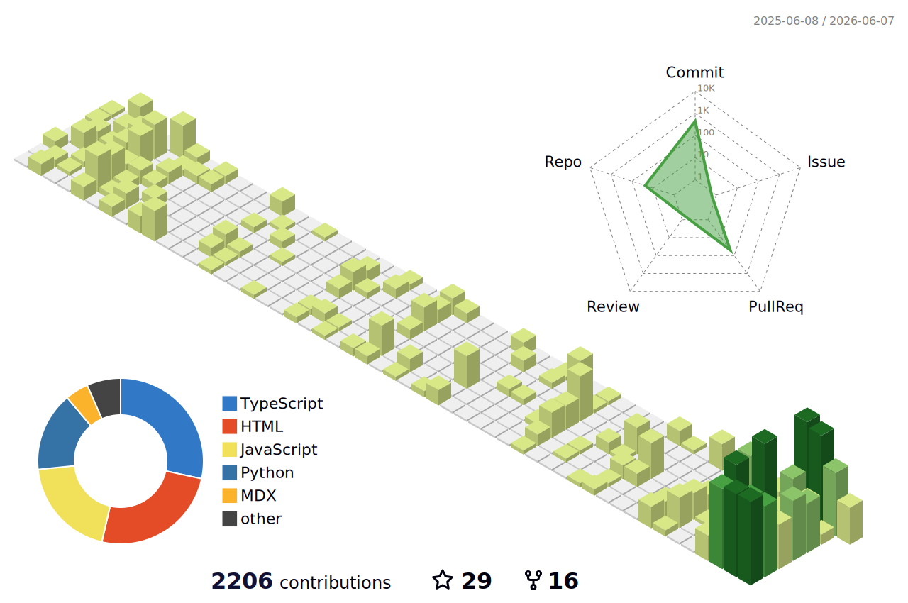

# Patrick Skinner

**AI Engineer · Learning Science Engineer · Educator**

On a mission to accelerate educational outcomes for 1 billion students.

---

## What I'm building right now

- **[SkyFi-MCP-server](https://github.com/PSkinnerTech/SkyFi-MCP-server)** — Enterprise MCP server for satellite imagery (Python)
- **[alpha-style](https://github.com/PSkinnerTech/alpha-style)** — AI design skill suite for Cursor, Claude Code, Codex, Gemini
- **[local-eye-tracking](https://github.com/PSkinnerTech/local-eye-tracking)** — Privacy-first webcam attention tracking for learning apps
- **[RankForge](https://github.com/PSkinnerTech/RankForge)** — Deterministic SEO/GEO audit CLI
- **[hypercompare](https://github.com/PSkinnerTech/hypercompare)** — LLM benchmarking on speed, accuracy, and cost
- **[ai-cost-intelligence](https://github.com/PSkinnerTech/ai-cost-intelligence)** — A/B test LLM prompts with statistical analysis

## Background

- 🪂 Former US Army Airborne Ranger Medic & Mass Casualty Coordinator
- 🎓 Gauntlet AI S25 graduate · Network School Cohort 1
- 🛠 Previously: Senior Developer Relations Engineer · Lead DevRel at Forward Research (Arweave)
- 📚 Mentor and Lead Instructor at [Gauntlet AI](https://gauntletai.com)

## Writing & talks

- [patrickskinner.tech](https://patrickskinner.tech) — portfolio & case studies
- [blog.patrickskinner.tech](https://blog.patrickskinner.tech) — engineering deep-dives
- [Substack](https://substack.com/@patskinner) — learning science notes
- [YouTube](https://youtube.com/@PSkinnerTech) — tutorials

## Connect

- 📧 [me@patrickskinner.tech](mailto:me@patrickskinner.tech)
- 💼 [LinkedIn](https://www.linkedin.com/in/patrickaskinner/)
- 🐦 [@PSkinnerTech on X](https://x.com/PSkinnerTech)

---

_Last updated: June 2026_
